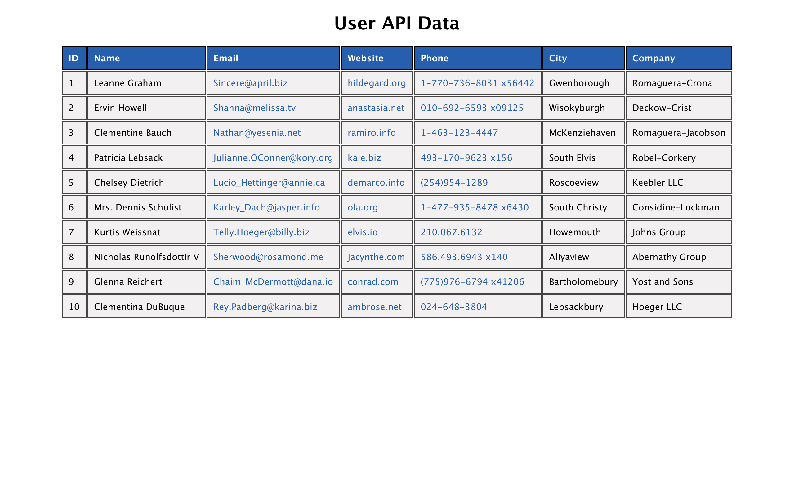

# fetchData-reactQuery
  [](https://opensource.org/licenses/MIT)
  
  deployment: https://gnartistic.github.io/reactAppDecisionlinks

  
  ## Description
  
  This is an example of data that I've fetched from an API in order to demonstrate my knowledge of fetching data using react-query's custom hooke `useQuery()`.
  
  ## Table of Contents
  
  [Installation Instructions](#installation-instructions)  
  [Usage Information](#usage-information)  
  [Contribution Guidelines](#contribution-guidelines)  
  [Test Instructions](#test-instructions)  
  [Questions](#questions)  
  
  ## Installation-Instructions
  
  Once you have cloned this repo to your local machine, please enter this snippet of code into the command-line at the root of the project.
  ```npm install```
  
  ## Usage-Information
  
  Enter this snippet of code to start the application.
  ```npm start```
  
  ## License
  
  MIT License
  
  ## Contribution-Guidelines
  
  I am accepting no project contributions at this time.
  
  ## Test-Instructions
  
  There are no testing conditions
  
  ## Questions
  
  GitHub Username: [@gnartistic](https://github.com/gnartistic)  
  
  Please feel free to reach out to me at [gn4rtistic@gmail.com](mailto:gn4rtistic@gmail.com) for questions

